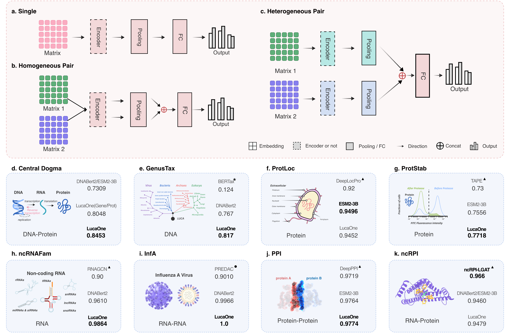

# Downstream Tasks of LucaOne   

## TimeLine      
* **2025/12/31**    
  LucaOne now supports the Hugging Face interface for further training.      
  It allows for various training modes, including using sequence-only inputs or injecting biological knowledge following the LucaOne framework. You can fine-tune the model for both sequence-level and token-level classification or regression tasks.        
  Please refer to the Hugging Face address: https://huggingface.co/collections/LucaGroup/lucaone, or the `huggingface` branch of this repository.

    - **Hugging Face Native**: Full support for `AutoModel`, `AutoModelForMaskedLM`, `AutoModelForSequenceClassification`, `AutoModelForTokenClassification`, `AutoConfig`, and `AutoTokenizer`.
    - **Unified Architecture**: Single model architecture handling multiple biological modalities.
    - **Task-Specific Heads**:
        - `LucaGPLMModel`: For sequences embedding.
        - `LucaGPLMForMaskedLM`: For pre-training and sequence recovery.
        - `LucaGPLMForSequenceClassification`: For sequence-level tasks (e.g., protein family, solubility, or promoter prediction).
        - `LucaGPLMForTokenClassification`: For residue-level tasks (e.g., secondary structure, binding sites, or post-translational modifications).
    - **Extensible**: Easily adaptable to custom downstream tasks using the standard `transformers` API.


* 2025/12/26:   
  LucaOne now supports **BF16** for embedding inference.      
  add parameter: **--use_bp16**

* 2025/08/15:     
  **Huggingface**     
  <a href='https://huggingface.co/LucaGroup'>https://huggingface.co/LucaGroup </a>

* 2025/04/08:
    * **LucaOne**          
      add `checkpoint=36000000` for `LucaOne`     
      location: <a href='http://47.93.21.181/lucaone/TrainedCheckPoint/latest/models/lucaone/lucaone/checkpoint-step36000000/'>checkpoint-step36000000</a>
    * **LucaOne-Gene**           
      add `checkpoint=36800000` for `LucaOne-Gene` (only trained using `DNA` and `RNA`)    
      location: <a href='http://47.93.21.181/lucaone/TrainedCheckPoint/latest/models/lucaone/lucaone-gene/checkpoint-step36800000/'>checkpoint-step36800000</a>
    * **LucaOne-Prot**        
      add `checkpoint=30000000` for `LucaOne-Prot` (only trained using `Protein`)     
      location: <a href='http://47.93.21.181/lucaone/TrainedCheckPoint/latest/models/lucaone/lucaone-prot/checkpoint-step30000000/'>checkpoint-step30000000</a>

* 2024/10/01: optimized embedding inference code: `src/llm/lucagplm/get_embedding.py`
* 2024/08/01: add `checkpoint=17600000`, location: <a href='http://47.93.21.181/lucaone/TrainedCheckPoint/models/lucagplm/v2.0/token_level,span_level,seq_level,structure_level/lucaone_gplm/20231125113045/checkpoint-step17600000/'>checkpoint-step17600000</a>

This project will download the checkpoint automatically from our `FTP` according to the value of parameter:
* **--llm_type**
* **--llm_version**
* **--llm_step**


## Embedding Recommendation
| --llm_type | --llm_version  |              --llm_step              |                 Usage (seq_type)                 |
|:----------:|:--------------:|:------------------------------------:|:------------------------------------------------:|
| `lucaone`  |   `lucaone`    | `36000000`, `17600000`, or `5600000` | both `gene` (i.e. `DNA`, `RNA`) and `prot` sequences |
| `lucaone`  | `lucaone-gene` |              `36800000`              |    only for `gene` (i.e. `DNA`, `RNA`) sequences     |
| `lucaone`  | `lucaone-prot` |              `30000000`              |             only for `prot` sequence             |


## 1. Networks    
Three distinct networks correspond to three different types of inputs: 
* LucaBase(Single)   
* LucaPPI(Homogeneous Pair)       
* LucaPPI2(Heterogeneous Pair)   


<center>


Fig. 1 Downstream task network with three input types and results comparison of 8 ver-
ification tasks.   
</center>


* Central Dogma(Central Dogma of Molecular Biology)    
  Input: DNA + Protein(heterogeneous double sequence)          
  Network: LucaPPI2(`src/ppi/models/LucaPPI2`)    


* SupKTax(Genus Taxonomy Annotation)     
  Input: DNA(single sequence)       
  Network: LucaBase(`src/common/luca_base`)   


* GenusTax(SuperKingdom Taxonomy Annotation)     
  Input: DNA(single sequence)       
  Network: LucaBase(`src/common/luca_base`)   


* SpeciesTax(Species Taxonomy Annotation)    
  Input: DNA(single sequence)       
  Network: LucaBase(`src/common/luca_base`)   


* ProtLoc(Prokaryotic Protein Subcellular Location)    
  Input: Protein(single sequence)       
  Network: LucaBase(`src/common/luca_base`)   


* ProtStab(Protein Stability)     
  Input: Protein(single sequence)       
  Network: LucaBase(`src/common/luca_base`)   


* ncRNAFam(Non-coding RNA Family)     
  Input: RNA(single sequence)         
  Network: LucaBase(`src/common/luca_base`)   


* InfA(Influenza A Antigenic Relationship Prediction)   
  Input: RNA + RNA(homogeneous double sequence)         
  Network: LucaPPI(`src/ppi/models/LucaPPI`)    


* PPI(Protein-Protein Interaction)     
  Input: Protein + Protein(homogeneous double sequence)           
  Network: LucaPPI(`src/ppi/models/LucaPPI`)   


* ncRPI(ncRNA-Protein Interactions)          
  Input: DNA + Protein(heterogeneous double sequence)          
  Network: LucaPPI2(`src/ppi/models/LucaPPI2`)

## 2. Environment Installation
### step1: update git
#### 1) centos
sudo yum update     
sudo yum install git-all

#### 2) ubuntu
sudo apt-get update     
sudo apt install git-all

### step2: install python 3.9
#### 1) download anaconda3
wget https://repo.anaconda.com/archive/Anaconda3-2022.05-Linux-x86_64.sh

#### 2) install conda
sh Anaconda3-2022.05-Linux-x86_64.sh
##### Notice: Select Yes to update ~/.bashrc
source ~/.bashrc

#### 3) create a virtual environment: python=3.9.13
conda create -n lucaone_tasks python=3.9.13

#### 4) activate lucaone_tasks
conda activate lucaone_tasks   


### for DNABert2 Embedding
**Notice：** Need to switch the virtual environment         

activate deactivate

conda create -n lucaone_tasks_dnabert2 python=3.9.13

conda activate lucaone_tasks_dnabert2

pip install -r requirements_dnabert2.txt -i https://pypi.tuna.tsinghua.edu.cn/simple


### step3:  install other requirements
pip install -r requirements.txt -i https://pypi.tuna.tsinghua.edu.cn/simple


## 3. Datasets   
Downstream Tasks Dataset FTP: <a href='http://47.93.21.181/lucaone/DownstreamTasksDataset/dataset/'>Dataset for LucaOneTasks</a>

Copy the 10 datasets from <href> http://47.93.21.181/lucaone/DownstreamTasksDataset/dataset/* </href> into the directory `./dataset/`


## 4. LucaOne Trained Checkpoint    
Trained LucaOne Checkpoint FTP: <a href='http://47.93.21.181/lucaone/TrainedCheckPoint/'>TrainedCheckPoint for LucaOne</a>        

**Notice**    
The project will download automatically LucaOne Trained-CheckPoint from **FTP**.     

When downloading automatically failed, you can manually download:       

Copy the **TrainedCheckPoint Files(`models/` + `logs/`)** from <href> http://47.93.21.181/lucaone/TrainedCheckPoint/* </href> into the directory `./llm/`


## 5. Usage of LucaOne Embedding(can also use LucaOneApp project)      
Methods of using embedding:    
In this project, the sequence is embedded during the training downstream task(`./src/encoder.py`).   

We can also embed the dataset and store into a predefined folder, then build and train the downstream network.   
the script of embedding a dataset(`./src/llm/lucagplm/get_embedding.py`):        


**建议与说明:**         
1）尽量使用显存大进行embedding 推理，如：A100，H100，H200等，这样一次性能够处理较长的序列，LucaOne在A100下可以一次性处理`3400`左右长度的序列；   
2）对于超长序列，LucaOne会进行Overlap分片进行embedding，最后合并成完整的embedding，请设置`--embedding_complete`与`--embedding_complete_seg_overlap`；    
3）如果显卡不足以处理输入的序列长度，会调用CPU进行处理，这样速度会变慢，如果你的数据集中长序列不是很多，那么可以使用这种方式: `--gpu_id -1`；      
4）如果你的数据集中长序列很多，比如: 万条以上，那么再设置`--embedding_complete`与`--embedding_complete_seg_overlap`之外，再加上设置`--embedding_fixed_len_a_time`，表示一次性embedding的最大长度。
如果序列长度大于这个长度，基于这个长度进行分片embedding，最后进行合并。否则根据序列的实际长度；    
5）如果不设置`--embedding_complete`，那么根据设置的`--truncation_seq_length`的值对序列进行截断embedding；  
6）对于蛋白，因为绝大部分蛋白长度在1000以下，因此超长蛋白序列不会很多，因此可以将`--embedding_fixed_len_a_time`设置长一点或者`不设置`；    
7）对于DNA，因为很多任务的DNA序列很长，那么请设置`--embedding_fixed_len_a_time`。    
如果数据集中超长序列数据量越多，该值设置越小一点，比如在A100下设置为`3400`，否则设置大一点，如果GPU根据这个长度embedding失败，则会调用CPU。如果数据集数不大，则时间不会很久；          
8）对于RNA，因为大部分RNA不会很长，因此与蛋白处理方式一致，因此可以将`--embedding_fixed_len_a_time`设置长一点或者不设置；

**Suggestions and Instructions:**
1) Try to use a large GPU-memory machine for embedding reasoning, such as A100, H100, H200, etc., so that long sequences can be processed once.       
   LucaOne can process sequences of about `3400` in length at one time under A100;
2) For long sequences, LucaOne will do overlapped fragments in the sequence for embedding and finally merge them into a completed embedding matrix.        
   Please set `--embedding_complete` and `--embedding_complete_seg_overlap`;
3) If the GPU memory is not enough to process the longer sequence, it will use the CPU for embedding, so the speed will be reduced.       
   If your dataset is small, then you can set: `--gpu_id -1`;
4) If your dataset includes a lot of long sequences (more than 10,000 sequences), please set: `--embedding_complete`, `--embedding_complete_seg_overlap`, and `--embedding_fixed_len_a_time` (represent the maximum length for embedding at one-time).       
   If the sequence length is greater than the value of `--embedding_fixed_len_a_time`, fragment embedding is performed based on this value, and finally, the merge is performed; otherwise, according to the actual length of the sequence;
5) If `--embedding_complete` is not set, the code will truncate the sequence embedding according to the value of `--truncation_seq_length`;
6) For proteins, the length of most proteins is less than 1000; there are not many ultra-long protein sequences, so the value of `--embedding_fixed_len_a_time` can be set a large value or not be set;
7) For DNA, the DNA sequence of many tasks is very long; please set `--embedding_fixed_len_a_time`.  
   The larger the amount of ultra-long sequence, the smaller value should be set, such as `3400` under A100.      
   If the GPU embedding fails to process the longer sequence, the CPU will be called.      
   When the amount of dataset is not large, the spent time will not be long;
8) For RNA, most RNA is not very long, so the processing method can be consistent with the protein, so the `--embedding_fixed_len_a_time` can be set a larger value or not be set.     
9) You can set `--use_bp16` for long sequences embedding;     

### 1) the **csv** file format of input     

**Notice:**       
a. need to specify the column index of the sequence id(*id_idx**) and sequence(**seq_idx**), starting index: 0.        
b. The **sequence id** must be globally unique in the input file and cannot contain special characters (because the embedding file stored is named by the sequence id).     

```shell
# for DNA or RNA
## using lucaone 
cd ./src/llm/lucagplm
export CUDA_VISIBLE_DEVICES="0,1,2,3,4,5,6,7,8" 
python get_embedding.py \
    --llm_dir ../../../ \
    --llm_type lucaone \
    --llm_version lucaone \
    --llm_step 36000000 \
    --truncation_seq_length 10240 \
    --trunc_type right \
    --seq_type gene \
    --input_file ../../../data/test_data/gene/test_gene.csv \
    --id_idx 0 \
    --seq_idx 1 \
    --save_path ../../../embedding/lucaone/test_data/gene/test_gene/ \
    --embedding_type matrix \
    --matrix_add_special_token \
    --embedding_complete \
    --embedding_complete_seg_overlap \
    --use_bp16 \
    --gpu_id 0  
```

```shell
## using lucaone-gene
export CUDA_VISIBLE_DEVICES="0,1,2,3,4,5,6,7,8"
python get_embedding.py \
    --llm_dir ../../../ \
    --llm_type lucaone \
    --llm_version lucaone-gene \
    --llm_step 36800000 \
    --truncation_seq_length 10240 \
    --trunc_type right \
    --seq_type gene \
    --input_file ../data/test_data/gene/test_gene.csv \
    --id_idx 0 \
    --seq_idx 1 \
    --save_path ../embedding/lucaone-gene/test_data/gene/test_gene/ \
    --embedding_type matrix \
    --matrix_add_special_token \
    --embedding_complete \
    --embedding_complete_seg_overlap \
    --use_bp16 \
    --gpu_id 0  
```

```shell
# for protein  
## using lucaone
cd ./src/llm/lucagplm
export CUDA_VISIBLE_DEVICES="0,1,2,3,4,5,6,7,8"
python get_embedding.py \
    --llm_dir ../../../ \
    --llm_type lucaone \
    --llm_version lucaone \
    --llm_step 36000000 \
    --truncation_seq_length 4096 \
    --trunc_type right \
    --seq_type prot \
    --input_file ../../../data/test_data/prot/test_prot.csv \
    --id_idx 2 \
    --seq_idx 3 \
    --save_path ../../../embedding/lucaone/test_data/prot/test_prot/ \
    --embedding_type matrix \
    --matrix_add_special_token \
    --embedding_complete \
    --embedding_complete_seg_overlap \
    --use_bp16 \
    --gpu_id 0  
 ```

```shell
## using lucaone-prot
python get_embedding.py \
    --llm_dir ../../../ \
    --llm_type lucaone \
    --llm_version lucaone-prot \
    --llm_step 30000000 \
    --truncation_seq_length 4096 \
    --trunc_type right \
    --seq_type prot \
    --input_file ../../../data/test_data/prot/test_prot.csv \
    --id_idx 2 \
    --seq_idx 3 \
    --save_path ../../../embedding/lucaone-prot/test_data/prot/test_prot/ \
    --embedding_type matrix \
    --matrix_add_special_token \
    --embedding_complete \
    --embedding_complete_seg_overlap \
    --use_bp16 \
    --gpu_id 0  
```

### 2) the **fasta** file format of input
**Notice:**     
a. The **sequence id** must be globally unique in the input file and cannot contain special characters (because the embedding file stored is named by the sequence id).

```shell
# for DNA or RNA  
## using lucaone
cd ./src/llm/lucagplm
export CUDA_VISIBLE_DEVICES="0,1,2,3,4,5,6,7,8"
python get_embedding.py \
    --llm_dir ../../../  \
    --llm_type lucaone \
    --llm_version lucaone \
    --llm_step 36000000 \
    --truncation_seq_length 10240 \
    --trunc_type right \
    --seq_type gene \
    --input_file ../../../data/test_data/gene/test_gene.fasta \
    --save_path ../../../embedding/lucaone/test_data/gene/test_gene/ \
    --embedding_type matrix \
    --matrix_add_special_token \
    --embedding_complete \
    --embedding_complete_seg_overlap \
    --use_bp16 \
    --gpu_id 0  
```

```shell
## using lucaone-gene  
python get_embedding.py \
    --llm_dir ../../../  \
    --llm_type lucaone \
    --llm_version lucaone-gene \
    --llm_step 36800000 \
    --truncation_seq_length 10240 \
    --trunc_type right \
    --seq_type gene \
    --input_file ../../../data/test_data/gene/test_gene.fasta \
    --save_path ../../../embedding/lucaone-gene/test_data/gene/test_gene/ \
    --embedding_type matrix \
    --matrix_add_special_token \
    --embedding_complete \
    --embedding_complete_seg_overlap \
    --use_bp16 \
    --gpu_id 0  
```   

```shell
# for protein  
## using lucaone
cd ./src/llm/lucagplm
export CUDA_VISIBLE_DEVICES="0,1,2,3,4,5,6,7,8"
python get_embedding.py \
    --llm_dir ../../../  \
    --llm_type lucaone \
    --llm_version lucaone \
    --llm_step 36000000 \
    --truncation_seq_length 4096 \
    --trunc_type right \
    --seq_type prot \
    --input_file ../data/test_data/prot/test_prot.fasta \
    --save_path ../embedding/lucaone/test_data/prot/test_prot/ \
    --embedding_type matrix \
    --matrix_add_special_token \
    --embedding_complete \
    --embedding_complete_seg_overlap \
    --use_bp16 \
    --gpu_id 0  
```

```shell
## using lucaone-prot
python get_embedding.py \
    --llm_dir ../../../  \
    --llm_type lucaone \
    --llm_version lucaone-prot \
    --llm_step 30000000 \
    --truncation_seq_length 4096 \
    --trunc_type right \
    --seq_type prot \
    --input_file ../data/test_data/prot/test_prot.fasta \
    --save_path ../embedding/lucaone-prot/test_data/prot/test_prot/ \
    --embedding_type matrix \
    --matrix_add_special_token \
    --embedding_complete \
    --embedding_complete_seg_overlap \
    --use_bp16 \
    --gpu_id 0  
```

  
### 3) Parameters    
1) LucaOne checkpoint parameters:
    * llm_dir: the path for storing the checkpoint LucaOne model，default: `../../../`
    * llm_type: the llm type, default: `lucaone`
    * llm_version: the version of LucaOne, default: `lucaone`, choices: [`lucaone`, `lucaone-gene`, `lucaone-prot`]
    * **llm_step:  the trained checkpoint of LucaOne**,  
      default:    
      `36000000` for `lucaone`, choices for `lucaone`: [`5600000`, `17600000`, `36000000`],        
      `36800000` for `lucaone-gene`,     
      `30000000` for `lucaone-prot`

2) Important parameters:        
    * embedding_type: `matrix` or `vector`, output the embedding matrix or [CLS] vector for the entire sequence, recommend: matrix.      
    * trunc_type: truncation type: `right` or `left`, truncation when the sequence exceeds the maximum length.    
    * truncation_seq_length: the maximum length for embedding(not including [CLS] and [SEP]), itself does not limit the length, depending on the capacity of GPU.            
    * matrix_add_special_token: if the embedding is matrix, whether the matrix includes [CLS] and [SEP] vectors.           
    * seq_type: type of input sequence: `gene` or `prot`, `gene` for nucleic acid(DNA or RNA), `prot` for protein.        
    * input_file: the input file path for embedding(format: csv or fasta). The seq_id in the file must be unique and cannot contain special characters.     
    * save_path: the saving dir for storing the embedding file, one sequence for one embedding file.
    * embedding_complete: When `embedding_complete` is set, `truncation_seq_length` is invalid. If the GPU memory is not enough to infer the entire sequence at once, it is used to determine whether to perform segmented completion (if this parameter is not used, 0.95*len is truncated each time until the CPU can process the length).
    * embedding_complete_seg_overlap: When `embedding_complete` is set, whether the method of overlap is applicable to segmentation(overlap sliding window)
    * embedding_fixed_len_a_time: When the input sequence is too long for your GPU to complete the inference at once, you can specify the fixed length of the inference at once(default: None)    
    * use_bp16: whether to use bp16;
    * gpu_id: the gpu id to use(-1 for cpu).

3) Optional parameters:      
    * id_idx & seq_idx: when the input file format is csv file, need to use `id_idx` and `seq_idx` to specify the column index in the csv (starting with 0).   

## 6. Usage of Downstream Models Inference
The <a href='http://47.93.21.181/lucaone/DownstreamTasksTrainedModels/'> FTP</a> includes the trained models of 10 downstream tasks(presented in the paper, all metrics in `TableS5`), all these trained models are based on LucaOne's embedding.        
Use the script `src/predict_v1.py` or `src/prediction.sh` to load the trained model and predict.

**Notice**    
The project will download automatically Trained-CheckPoint of all downstream tasks from **FTP**.

When downloading automatically failed, you can manually download:

Copy the **DownstreamTasksTrainedModels Files(`models/` + `logs/`)** from <href> http://47.93.21.181/lucaone/DownstreamTasksTrainedModels/ </href> into the project `LucaOneTasks/`


The shell script of all downstream task models for inference in `LucaOneTasks/src/prediction.sh`

```shell 
cd LucaOneTasks/src/
# input file format(csv, the first row is csv-header), Required columns: seq_id_a, seq_id_b, seq_type_a, seq_type_b, seq_a, seq_b
# seq_type_a must be gene, seq_type_a must be prot
export CUDA_VISIBLE_DEVICES="0,1,2,3"
python predict_v1.py \
    --input_file ../test/CentralDogma/CentralDogma_prediction.csv \
    --llm_truncation_seq_length 4096 \
    --model_path .. \
    --save_path ../predicts/CentralDogma/CentralDogma_prediction_results.csv \
    --dataset_name CentralDogma \
    --dataset_type gene_protein \
    --task_type binary_class \
    --task_level_type seq_level \
    --model_type lucappi2 \
    --input_type matrix \
    --input_mode pair \
    --time_str 20240406173806 \
    --print_per_num 1000 \
    --step 64000 \
    --threshold 0.5 \
    --gpu_id 0
```

## 7. Downstream Tasks        
The running scripts of 10 downstream tasks in three directories:      

1) `src/training/lucaone` :     
   The running scripts of the 10 downstream tasks were based on LucaOne's embedding **(Fig. 4 in our paper)**.


2) `src/training/downstream_tasks` :     
   A complete comparison on the 10 downstream tasks.   
   These comparisons were based on the embedding of LucaOne, DNABert2, and ESM2-3B. **(Table.S5 in our paper)**.    


3) `src/training/lucaone_separated` :      
   The task script with the embedding based on the LucaOne of separated nucleic acid and protein training(LucaOne-Gene/LucaOne-Prot). **(Fig. 3 in our paper)**.      


## 8. Data and Code Availability
**FTP:**   
Pre-training data, code, and trained checkpoint of LucaOne, embedding inference code, downstream validation tasks data & code, and other materials are available: <a href='http://47.93.21.181/lucaone/'>FTP</a>.

**Details:**

The LucaOne's model code is available at: <a href='https://github.com/LucaOne/LucaOne'>LucaOne Github </a> or <a href='http://47.93.21.181/lucaone/LucaOne/'>LucaOne</a>.

The trained-checkpoint files are available at: <a href='http://47.93.21.181/lucaone/TrainedCheckPoint/latest'>TrainedCheckPoint</a>.

LucaOne's representational inference code is available at: <a href='https://github.com/LucaOne/LucaOneApp'>LucaOneApp Github</a> or <a href='http://47.93.21.181/lucaone/LucaOneApp'>LucaOneApp</a>.

The project of 8 downstream tasks is available at: <a href='https://github.com/LucaOne/LucaOneTasks'>LucaOneTasks Github</a> or <a href='http://47.93.21.181/lucaone/LucaOneTasks'>LucaOneTasks</a>.

The pre-training dataset of LucaOne is opened at: <a href='http://47.93.21.181/lucaone/PreTrainingDataset/'>PreTrainingDataset</a>.

The datasets of downstream tasks are available at: <a href='http://47.93.21.181/lucaone/DownstreamTasksDataset/'> DownstreamTasksDataset </a>.

The trained models of downstream tasks are available at: <a href='http://47.93.21.181/lucaone/DownstreamTasksTrainedModels/'> DownstreamTasksTrainedModels </a>.

Other supplementary materials are available at: <a href='http://47.93.21.181/lucaone/Others/'> Others </a>.


## 9. Contributor        
<a href="https://scholar.google.com.hk/citations?user=RDbqGTcAAAAJ&hl=en" title="Yong He">Yong He</a>,
<a href="https://scholar.google.com/citations?user=lT3nelQAAAAJ&hl=en" title="Zhaorong Li">Zhaorong Li</a>,
<a href="https://scholar.google.com/citations?view_op=list_works&hl=en&user=uvrzUfEAAAAJ" title="Yongtao Shan">Yongtao Shan</a>, Yanhong Wei,
<a href="https://scholar.google.com.hk/citations?hl=zh-CN&pli=1&user=Zhlg9QkAAAAJ" title="Yuan-Fei Pan">Yuan-Fei Pan</a>,
<a href="https://scholar.google.com/citations?user=1KJOH7YAAAAJ&hl=zh-CN&oi=ao" title="Mang Shi">Mang Shi</a>


## 10. Zenodo        
We have uploaded the model code, training scripts, and embedding inference scripts of LucaOne;    
The mode code, training and evaluation scripts, datasets, and trained models for downstream tasks,    
and additional supplementary materials to Zenodo (10.5281/zenodo.15171943).    
However, due to the substantial size of the pretraining dataset of LucaOne, it has not been included on Zenodo.     
Instead, it remains accessible via our publicly available FTP server (**<a href='http://47.93.21.181/lucaone/PreTrainingDataset/'>LucaOne Pretraining dataset</a>**).     
We are actively seeking an open FTP platform with sufficient storage capacity to host our pretraining dataset.

**<a href='https://doi.org/10.5281/zenodo.15171943'>LucaOne Zenodo</a>**

## 11. Citation
**<a href='https://www.biorxiv.org/content/10.1101/2024.05.10.592927v2'>LucaOne Biorxiv</a>**   
**<a href='https://www.nature.com/articles/s42256-025-01044-4'>LucaOne NMI 2025</a>**


He, Y., Fang, P., Shan, Y. et al. Generalized biological foundation model with unified nucleic acid and protein language. Nat Mach Intell 7, 942–953 (2025). https://doi.org/10.1038/s42256-025-01044-4


## 12. LucaTeam

<center>


Fig. 5 LucaTeam at the West Lake in Hangzhou.
</center>   
  